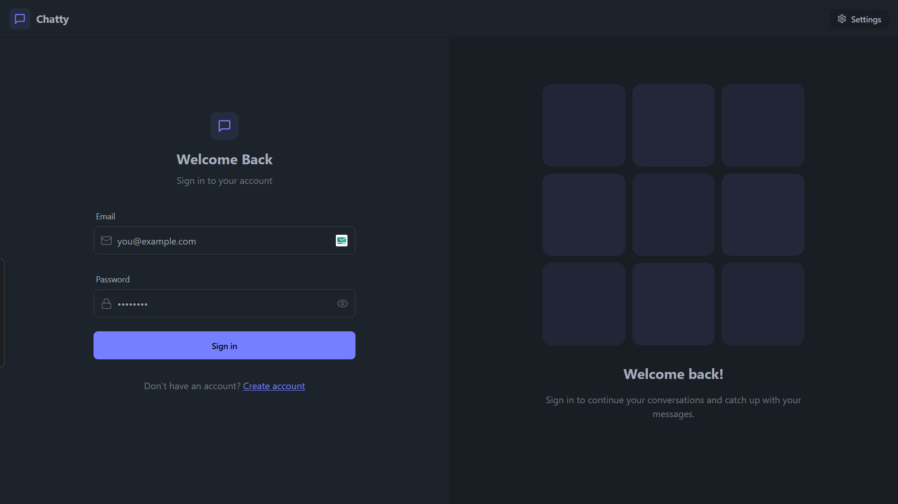

# 🚀 CHATTY - Real-time Chat Application

<div align="center">
  <h2>
    <a href="https://chatty-realtime-chatting.onrender.com/login" target="_blank">
      🔴 LIVE DEMO
    </a>
  </h2>

  
</div>

## 📱 About

**Chatty** is a modern, feature-rich real-time chat application built with the MERN stack (MongoDB, Express, React, Node.js) and Socket.io. It provides a seamless communication experience with a beautiful, responsive UI.

## ✨ Key Features

- **Real-time messaging** powered by Socket.io
- **User authentication** with JWT
- **Online status indicators** for active users
- **Image sharing** via Cloudinary integration
- **Responsive design** for all devices
- **Dark/Light mode** toggle
- **Clean, modern UI** built with TailwindCSS and Daisy UI

## 🛠️ Tech Stack

### Frontend
- React + Vite
- TailwindCSS + Daisy UI
- Zustand for state management
- Socket.io client

### Backend
- Node.js + Express
- MongoDB + Mongoose
- Socket.io
- JWT Authentication
- Cloudinary

## 🚀 Getting Started

### Prerequisites
- Node.js and npm
- MongoDB

### Installation

1. **Clone the repository**
   ```bash
   git clone https://github.com/sainath-666/CHATTY_REALTIME_CHATTING.git
   cd CHATTY_REALTIME_CHATTING
   ```

2. **Install dependencies**
   ```bash
   # Install backend dependencies
   cd backend
   npm install

   # Install frontend dependencies
   cd ../frontend
   npm install
   ```

3. **Start the development servers**
   ```bash
   # Start backend (from backend directory)
   npm run dev

   # Start frontend (from frontend directory)
   npm run dev
   ```

## 📁 Project Structure

```
CHATTY_REALTIME_CHATTING/
├─ backend/
│  ├─ src/
│  │  ├─ controllers/
│  │  ├─ lib/
│  │  ├─ middleware/
│  │  ├─ models/
│  │  ├─ routes/
│  │  ├─ seeds/
│  │  └─ index.js
├─ frontend/
│  ├─ public/
│  ├─ src/
│  │  ├─ components/
│  │  ├─ constants/
│  │  ├─ lib/
│  │  ├─ pages/
│  │  ├─ store/
│  │  ├─ App.jsx
│  │  └─ main.jsx
```

## 🌐 Deployment

### Build the app
```bash
npm run build
```

### Start the production server
```bash
npm start
```

## 👨‍💻 Contributing

Contributions are welcome! Feel free to open issues or submit pull requests.

## 📝 License

This project is licensed under the MIT License - see the LICENSE file for details.

## 🔗 Connect With Me

[](https://www.linkedin.com/in/sainath666)

---

<div align="center">
  <p>Made with ❤️ by Sainathreddy</p>
</div>
